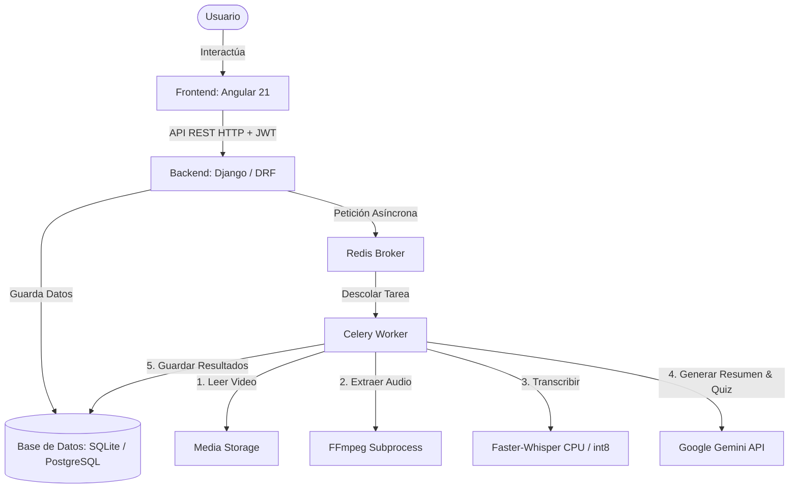
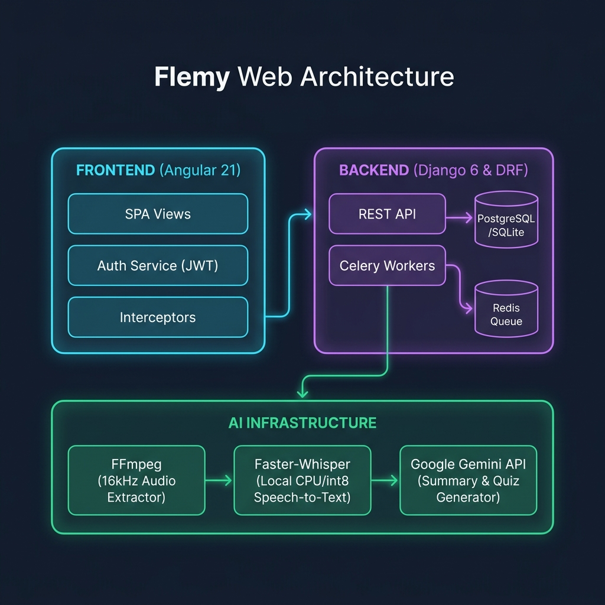

# Arquitectura del Proyecto Flemy

Este documento detalla la arquitectura técnica global del proyecto **Flemy**, desglosando la estructura del frontend, del backend y la infraestructura de Inteligencia Artificial (IA) para la transcripción y generación de contenido pedagógico automatizado.

---

## 1. Arquitectura General del Sistema

El sistema sigue una arquitectura desacoplada basada en el patrón de **Cliente-Servidor** y procesamiento de tareas asíncronas en segundo plano:



### Diagrama Visual de Arquitectura



---

## 2. Arquitectura del Frontend (Angular 21)

El frontend está desarrollado con **Angular 21** (una de las versiones más modernas y optimizadas del framework) con un diseño totalmente modular y orientado a componentes.

### Características Principales:
* **Arquitectura Orientada a Componentes (Component-Driven)**: Cada vista (Dashboard, Catálogo, Perfil, Ajustes) está aislada en su propio directorio con sus estilos CSS locales, plantilla HTML y lógica TypeScript.
* **Sistema de Rutas Declarativo (`app.routes.ts`)**: Define el mapeo de navegación de la aplicación:
  * `/login` y `/register`: Acceso público.
  * `/forgot-password` y `/reset-password`: Flujos de recuperación de contraseñas.
  * `/dashboard`: Panel principal interactivo del estudiante.
  * `/admin/dashboard`: Panel de administración (protegido por un Guard).
  * `/catalog`: Catálogo general de cursos disponibles.
  * `/catalog/:slug`: Vista detallada de un curso (reproductor de video, resúmenes de IA, listado de conceptos clave, autoevaluaciones/quizzes interactivos).
  * `/perfil` y `/configuracion`: Gestión de perfil de usuario y configuraciones de cuenta.
  * `/subscription`: Gestión de suscripciones y pasarelas de pago.
* **Modularidad y Seguridad**:
  * **`AuthService`**: Gestor central de la autenticación de usuarios. Almacena y refresca los tokens JWT de manera segura.
  * **`AuthInterceptor`**: Interceptor HTTP que adjunta automáticamente el token Bearer (`JWT`) en la cabecera `Authorization` de todas las peticiones salientes al backend.
  * **`ErrorInterceptor`**: Captura errores HTTP globales para alertar al usuario mediante notificaciones visuales controladas.
  * **`AdminGuard`**: Protector de rutas para asegurar que solo los usuarios administradores puedan acceder al panel de gestión.
  * **Componentes Compartidos (Shared)**: Reutilización de elementos transversales como `TopBar` (cabecera), `Toast` (notificaciones flotantes), `Skeleton` (pantallas de carga fluida) y `Notifications`.

---

## 3. Arquitectura del Backend (Django & Django REST Framework)

El backend está desarrollado sobre **Python 3.13-slim** utilizando **Django 6.0.4** y **Django REST Framework (DRF) 3.17.1** para exponer una API REST robusta y escalable.

### Capas Principales:
1. **API REST / Controladores (`views.py` e `urls.py`)**: Exposición de los endpoints HTTP organizados por recursos.
2. **Modelos (`models.py`)**: Definición del esquema de datos persistido en la base de datos (SQLite en entorno de desarrollo, compatible con PostgreSQL en producción).
3. **Servicios (`services/`)**: Lógica de negocio encapsulada y desacoplada del controlador.
4. **Tareas Asíncronas (`tasks.py`)**: Tareas pesadas que se ejecutan en segundo plano utilizando **Celery (5.5.0)** y **Redis (5.2.1)** como broker de mensajes.

### Módulos del Backend:
* **`users`**: Gestión de cuentas, roles de usuario (estudiante / administrador) y autenticación segura con **SimpleJWT**.
* **`courses`**: Núcleo de la plataforma educativa. Administra cursos, módulos, lecciones y subidas de videos.
* **`ai_tools`**: Centralización de las herramientas y prompts de IA.
* **`gamification`**: Sistema de recompensas, puntajes e insignias para motivar el aprendizaje.
* **`billing`**: Registro de suscripciones e historial de transacciones.
* **`config`**: Configuración central de Django (`settings.py`, `urls.py`, `wsgi.py`).

---

## 4. Arquitectura de Inteligencia Artificial (IA)

La IA es uno de los pilares del proyecto, encargándose de transformar videos educativos en materiales interactivos de alta calidad en segundos.

### A. Extracción de Audio (`ffmpeg`)
Cuando se sube un video, el backend debe preparar el audio para poder transcribirlo.
* **Software utilizado**: **FFmpeg** y **FFprobe** a nivel de sistema operativo (instalados en la imagen Docker base mediante `apt-get install -y ffmpeg`).
* **Lógica en el código (`video_processing.py`)**:
  * **`ffprobe`**: Ejecutado mediante el módulo `subprocess` para extraer con exactitud la duración del video en segundos, asegurando la consistencia de metadatos.
  * **`ffmpeg`**: Ejecuta una extracción directa del stream de audio convirtiéndolo en un archivo temporal con el formato óptimo requerido por Whisper:
    * **Formato**: WAV (`-vn` para omitir video).
    * **Codec de Audio**: PCM de 16 bits sin pérdidas (`-acodec pcm_s16le`).
    * **Frecuencia de Muestreo (Sample Rate)**: 16,000 Hz (`-ar 16000`), la frecuencia nativa con la que se entrenó a Whisper.
    * **Canales**: 1 canal / Mono (`-ac 1`), para optimizar el almacenamiento y el procesamiento del modelo.

### B. Transcripción de Audio (`Whisper`)
* **Lógica local con `faster-whisper` (v1.1.0)**: En lugar de usar la costosa API de OpenAI, el proyecto implementa un modelo **Whisper local** a través de la biblioteca `faster-whisper`.
* **¿Qué es `faster-whisper`?**: Es una reimplementación del modelo Whisper de OpenAI que utiliza **CTranslate2**, un motor de inferencia rápido para redes neuronales Transformer escrito en C++.
* **Optimización en Flemy**:
  * **Carga Perezosa (Lazy Loading)**: El modelo solo se carga en la memoria RAM la primera vez que se requiere procesar un video, evitando consumo de recursos al iniciar el servidor.
  * **Cuantización de 8 bits (`int8`)**: Reduce la huella de memoria RAM de forma drástica al convertir los pesos del modelo de precisión flotante (`float16`/`float32`) a enteros de 8 bits, lo cual permite un rendimiento excepcional en CPUs locales.
  * **Configuración Dinámica (`settings.py`)**: Utiliza `WHISPER_MODEL = env('WHISPER_MODEL', default='base')`. Permite elegir modelos desde `'tiny'` y `'small'` hasta `'medium'` o `'large'` según los recursos disponibles de hardware.
  * **Muestreo Inteligente**: Ejecuta `whisper_model.transcribe(audio_path, beam_size=5)` para obtener transcripciones altamente precisas segmentadas por tiempos de inicio y fin (`start` y `end`).

### C. Generación de Resúmenes y Quizzes (`Google Gemini API`)
Una vez obtenida la transcripción estructurada del audio, el backend genera el material académico.
* **Tecnología**: **Google Gemini API** (gratuito) mediante la biblioteca oficial `google-generativeai` (v0.8.3).
* **Modelo utilizado**: `gemini-3-flash-preview` (o versión de Flash de bajo consumo).
* **Petición Única Optimizada (Single-Call Pipeline)**: Para ahorrar latencia, API Rate-Limits y tokens, el prompt diseñado en `ai_services.py` solicita simultáneamente:
  1. Un **Resumen detallado** estructurado en párrafos (de 4 a 7 párrafos, escrito como si analizara un video directamente).
  2. Un conjunto de **Conceptos Clave** (Key Points).
  3. Un **Quiz de Evaluación** con preguntas interactivas de opción múltiple (exactamente 4 opciones, alteración de la posición correcta aleatoriamente y explicaciones didácticas detalladas de cada respuesta).
* **Formateo de Respuesta**: Se fuerza a Gemini a responder en formato **JSON estricto**. El código cuenta con parsers robustos con expresiones regulares por si la IA introduce bloques de código markdown (` ```json `).
* **Sistema de Fallback Activo**: Si no se dispone de una API Key de Gemini configurada o si el servicio falla, se dispara automáticamente el modo de respaldo (`_fallback_summary` y `_fallback_quiz`), que procesa el texto mediante algoritmos heurísticos en Python para simular el resumen y las preguntas del quiz sin interrumpir la experiencia de usuario.

---

## 5. El Flujo de Trabajo Asíncrono de un Video

1. El usuario administrador sube un archivo de video desde el **Frontend**.
2. El **Backend (Django REST Framework)** recibe el video, guarda un registro en la base de datos con estado `PENDING` y despacha el ID de la tarea a **Celery** (a través de Redis).
3. **Celery Worker** toma la tarea de forma asíncrona:
   - Cambia el estado a `PROCESSING` y avisa que está extrayendo audio (`EXTRACTING_AUDIO`).
   - Llama a **FFmpeg** para extraer y codificar el audio a 16kHz WAV mono.
   - Pasa el audio a **faster-whisper** para la transcripción a texto con marcas de tiempo (`TRANSCRIBING`).
   - Envía el bloque de texto de la transcripción a la API de **Google Gemini** para la redacción del resumen y el diseño de las preguntas del examen interactivo (`GENERATING_SUMMARY`).
   - Almacena el resumen, conceptos y quiz en la base de datos vinculándolos al video.
   - Elimina de forma segura los archivos temporales de audio generados.
   - Actualiza el estado a `COMPLETED`.
4. El estudiante en el **Frontend** accede a la lección y ve instantáneamente el reproductor multimedia, el resumen redactado con Inteligencia Artificial y puede tomar la prueba evaluativa en tiempo real.
